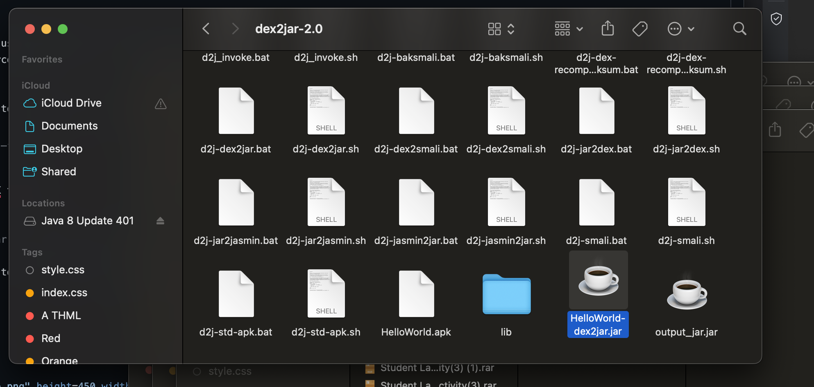

# Reverse Engineering Android Application

Reverse engineering an Android application typically involves analyzing the compiled code of the app to understand its functionality, identify any vulnerabilities, or modify it for a specific purpose. To reverse engineer an Android app, you need some tools that can help you extract, decode, and modify the app's files.


- we need :
 - apktool — tool for reverse engineering Android apk files. In this case we are using to extract files from apk and rebuild.
 - JD-GUI — To view java code
 - dex2jar — Converts Android dex files to class/jar files.
# 1- Decompile the APK

## Installation Apktool :


```bash
brew install apktool
```
  


Use the following command to decompile HelloWorld.apk  :

```bash
apktool d /Users/waadalkatheri/Desktop/HelloWorld.apk
```


  
 

Running the following command decompiles the resources and the XML files of the APK to human-readable form and the Java, and Kotlin code to smali files.


  
 

# 2- Analyze the decompiled code

Once the APK file is decompiled, the code can be analyzed to understand how the application works. This may include identifying the different components of the application, such as the activities, services, and receivers, as well as any third-party libraries or APIs used by the application.

The first activity that is called when the application is launched is
```bash com.dns.helloworld1.MainActivity  ```  with the action `android.intent.action.MAIN` and the category `android.intent.category.LAUNCHER.` This configuration signifies that MainActivity is the entry point of the application.

  


This snippet of code is from an Android application written in Smali, which is an assembly language used for the Dalvik bytecode that runs on Android devices. It represents  when the user interacts with the Button and shows a short toast message saying "HELLO WORLD!"

  

 
## 3- Reverse engineer the code


change the toast message to "I GOT IT" in the `MainActivity` to "I GOT IT"


  


## 4- Extracting the Code 
 convert dex files to jar files using the dex2jar tool. JD-GUI can be used to decompile the standard java .class files, which usually be packaged in a jar file, into the readable source code. 
 Download the dex2jar tool :
 
 On Mac or Linux you might have to give the script the permission to be executed.
 ```bash
sudo chmod +x d2j-dex2jar.sh d2j_invoke.sh
```

Run this command to convert .APK to .RAR:
 ```bash
 
./d2j-dex2jar.sh -f -o output_jar.jar HelloWorld.apk
```

  

 Once the APK file is converted to a JAR file, you can use JD-GUI to decompile and analyze the Java code. 

 ```bash
 
brew install --cask jd-gui
```
after running the jar file we can represent  JAVA code and analyze it.
  


 ## Summary:
The guide provides a detailed walkthrough for reverse engineering an Android app, from decompiling the APK to analyzing and modifying its code. It emphasizes the importance of understanding the application's structure, identifying entry points, and modifying its behavior. The document serves as a practical resource for developers or anyone interested in Android app internals.
