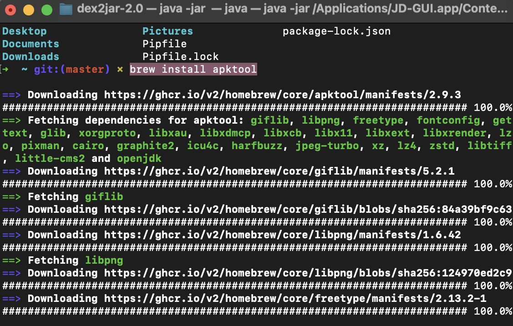

# Reverse Engineering Android Application

Reverse engineering an Android application typically involves analyzing the compiled code of the app to understand its functionality, identify any vulnerabilities, or modify it for a specific purpose. To reverse engineer an Android app, you need some tools that can help you extract, decode, and modify the app's files.
# 1- Decompile the APK

## Installation Apktool


```bash
brew install apktool
```
### Screen shote 
  


to decompile the HelloWorld.apk use apktool run :

```bash
apktool d /Users/waadalkatheri/Desktop/HelloWorld.apk
```


  
 

Running the following command decompiles the resources and the XML files of the APK to human-readable form and the Java, and Kotlin code to smali files.


  
 

# 2- Analyze the decompiled code

Once the APK file is decompiled, the code can be analyzed to understand how the application works. This may include identifying the different components of the application, such as the activities, services, and receivers, as well as any third-party libraries or APIs used by the application.

The first activity that is called when the application is launched is
```bash com.dns.helloworld1.MainActivity  ``` This is specified within the  ` <activity> `  tag that includes a `<intent-filter>` with the action `android.intent.action.MAIN` and the category `android.intent.category.LAUNCHER.` This configuration signifies that MainActivity is the entry point of the application.

  


This snippet of code is from an Android application written in Smali, which is an assembly language used for the Dalvik bytecode that runs on Android devices. It represents  when the user interacts with the Button and shows a short toast message saying "HELLO WORLD!"

  

### Screen shote 
 
## 3- Reverse engineer the code


change the toast message to "I GOT IT" in the `MainActivity` to "I GOT IT"
  


## 4- Extracting the Code 
 convert dex files to jar files using the dex2jar tool. Download the dex2jar tool :
 
 On Mac or Linux you might have to give the script the permission to be executed.
 ```bash
sudo chmod +x d2j-dex2jar.sh d2j_invoke.sh
```

Run this command to convert .APK to .RAR:
 ```bash
 
./d2j-dex2jar.sh -f -o output_jar.jar HelloWorld.apk
```

brew install --cask jd-gui

Open the JAR file in JADX: Once the APK file is converted to a JAR file, you can use JADX to decompile and analyze the Java code. To open the JAR file in JADX, open a terminal or command prompt and navigate to the directory where the JAR file is located. Then, type the following command:


  
